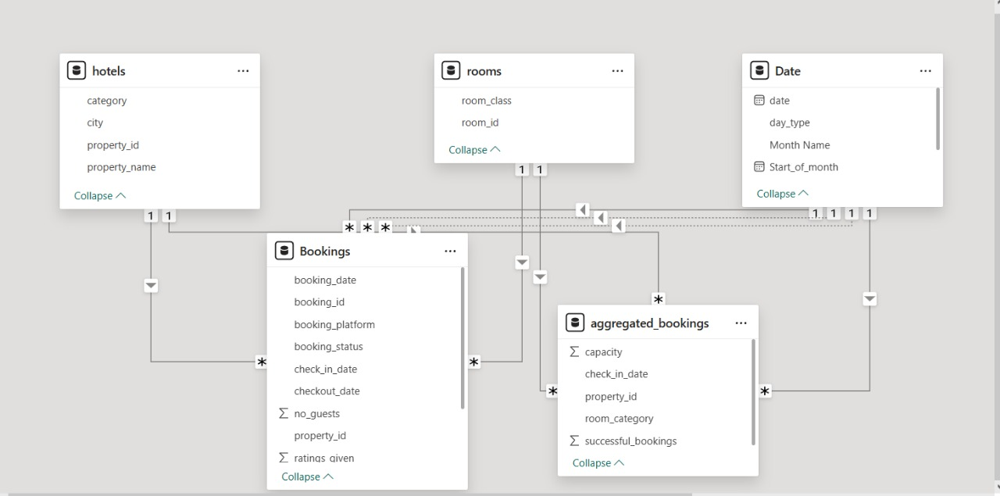
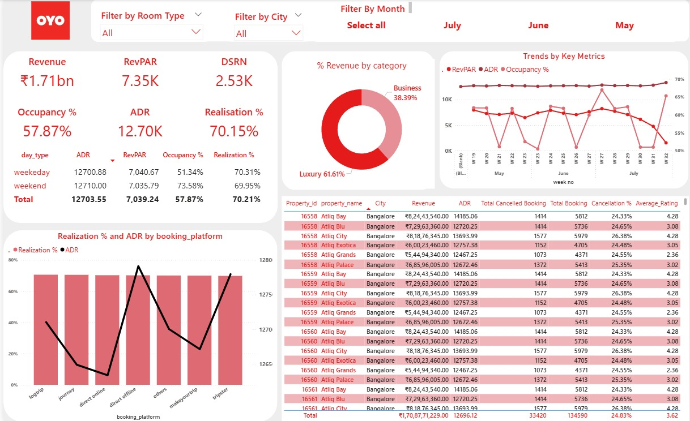

# OYO Performance Analysis - Project Overview
## The business currently lacks a centralized and dynamic solution for monitoring, analyzing, and understanding key performance indicators (KPIs) such as overall revenue, RevPAR, ADR, occupancy, and booking realization across its property portfolio. This lack of consolidated, real-time insights limits the organization's ability to:

- Effectively optimize pricing and revenue management strategies across various properties, cities, room types, and customer segments (e.g., business, luxury).
- Promptly identify underperforming areas or properties and uncover root causes, such as low occupancy, suboptimal ADR, or poor channel performance.
- Make informed decisions regarding the booking channel mix by clearly assessing which platforms deliver the best returns in terms of ADR and realization.
- Track performance trends—weekly, seasonally, and by weekday vs. weekend—to better anticipate demand and adjust strategies proactively.

## To address these challenges, the organization requires a comprehensive visualization solution that offers a high-level overview of business health, enables detailed drill-down into specific segments, and supports data-driven decision-making. Such a tool would empower teams to enhance revenue, improve operational efficiency, and drive sustainable growth. 

### Tech Stack

The dashboard was built using the following tools and technologies: 
•	📊 Power BI Desktop – Main data visualization platform used for report creation. 
•	📂 Power Query – Data transformation and cleaning layer for reshaping and preparing the data. 
•	🧠 DAX (Data Analysis Expressions) – Used for calculated measures, dynamic visuals, and conditional logic. 
•	📝 Data Modeling – Relationships established among tables (resorts, snow, and data_dictionary) to enable cross-filtering and aggregation. 
•	📁 File Format – .pbix for development and .jpeg for dashboard previews.
## Dataset Structure
#### 1. Fact Tables
- **Bookings**: Core transactional table holding individual hotel booking records.
- **aggregrated_bookings**: Contains daily booking metrics and room category.

#### 2. Dimension / Lookup Tables
- **Hotels**: Contains metadeta about each hotel.
- **Rooms**: Describes the rooms available in each hotel.
- **Date**: Standard date dimension for time-based analysis.

## Understanding the metrics
- **No Show Booking**: "No show" means those customers who neither cancelled nor attend to their booked rooms.
- **ADR**: It is the ratio of revenue to the total rooms booked/sold. It is the measure of the average paid for rooms sold in a given time period.
- **Realisation %**: It is nothing but the succesful "checked out" percentage over all bookings happened.
- **RevPAR**: RevPAR represents the revenue generated per available room, whether or not they are occupied. RevPAR helps hotels measure their revenue generating performance to accurately price rooms.
- **DSRN**: This metrics tells on average how many rooms are ready to sell for a day considering a time period.
- **Revenue WoW Change %**: the revenue change percentage week over week.

## Insights Summary
#### In order to evaluate hotel performance, we focused on the following key metrics:

- **Revenue**: Total earnings generated from bookings.
- **RevPAR (Revenue Per Available Room)**
- **ADR (Average Daily Rate)**
- **Occupancy %**: Reflects room utilization across properties.
- **Realization %**
- **DSRN (Daily Successful Room Nights)**
  
#### Revenue
- Total revenue across all properties is **₹1.71bn**.
- Luxury properties contribute **61.61%** of the revenue, while business properties account for **38.39%**.
- Top-performing city is Bangalore, with properties like Atliq Bay and Atliq City leading in revenue.

#### RevPAR (Revenue Per Available Room)
- Overall RevPAR is **₹7.35K**.
- Slightly higher on weekdays (₹7,040.67) than on weekends (₹7,035.79).
- Higher RevPAR is associated with properties showing better occupancy, indicating effective pricing.

#### Occupancy %
- Overall occupancy rate is **57.87%**.
- Occupancy is significantly higher on weekends **(73.58%)** compared to weekdays **(51.34%)**.
  
#### ADR (Average Daily Rate)
- Overall realization rate is **70.15%*.
- Weekday realization (70.31%) is slightly higher than weekend (69.95%), possibly due to fewer cancellations by business travelers.
 
#### Trends & Platform Performance
- Booking trends fluctuate weekly, with mid-month dips and end-of-month recoveries in occupancy and RevPAR.
- Direct offline and corporate platforms show consistently high realization rates.
- Average cancellation rate is **24.83%**; average customer rating is **3.62**, indicating moderate satisfaction with scope for improvement.

## Dashboard

